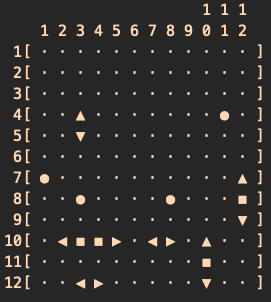

# Project Battleship Puzzle Generator Rust Version

The program consists in creating a set of distinct Battleship puzzles and write them to an output file.
The quantity of puzzles and their dimensions should be specified by the user through **command line arguments**.

_This is an open-source adaptation to Rust from the [original project](https://github.com/Dio720/Battleship-Puzzle-Game-Generator-docs) made by me and @gabrieloak123 in c++_

## 2. The Battleship Puzzle

A Battleship puzzle is composed of two entities: a `n x m` grid matrix of cells that represents the puzzle board (i.e., the ocean), and; a set of ships (_armada_) that must be arranged on the matrix board according to some rules.

For this project, in particular, a valid puzzle matrix may have any dimensions between $7$ and $16$ for both rows or columns.
The armada is composed of $10$ ships that your automatic generator needs to place on the matrix board.
These ships are:

- 01 Battleship, with length = $4$ cells.
- 02 Destroyers, with length = $3$ cells.
- 03 Cruisers, with length = $2$ cells.
- 04 Submarines, with length = $1$ cells.

Each ship occupies their length in contiguous cells of the grid, arranged either _horizontally_ or _vertically_.
The ships are positioned in such a way that there are always cells representing water (i.e. unoccupied free cells) around any two ships.
In other words, a ship must not occupy a cell that is neighbour of another ship's cell, not even diagonally.
A ship may touch the edge of the matrix.

## 3. Input

The program should run in a terminal as follows:

```
$ ./bpg [<options>] <number_of_puzzles>
```

If the user provides any wrong input or calls the program with no parameters, the application should display the proper error message (if that is the case) and print out the help as follows:

```
$ ./bpg
Usage: [<options>] <number_of_puzzles>
  Program options are:
    --rows <num>	Specify the number of rows for the matrix,
                        with `<num>` in the range [7, 16 ].
                        The default value is 10.
    --cols <num>	Specify the number of columns for the matrix,
                        with `<num>` in the range [7,16].
                        The default value is 10.
  Requested input is:
    number_of_puzzles	The number of puzzles to be generated,
                        in the range [1,100].
```

Note that the option parameters _may be specified in any order_, and the user may want puzzles with number of rows different from the number of columns.

In the situation below, the user wants $30$, `10x10` puzzles. Because the user omitted the dimensions, the application assumes the default values, which is $10$ for both dimensions.

## 4. Output

The program is able to produce **two** types of output files.

The first one is called `the matrix-format`. It contains an ascii representations of the entire board for each puzzle, so we can see the location and orientation of each individual ship on the matrix-board. This is a convenient way of visualising the puzzles. Each puzzle should be separated by a blank line. The columns and rows must all have numbers to help identify each ship's coordinate.

The second format is called `the armada-format`. It contains a compact text representation for each puzzle. Each individual puzzle has 10 lines, one for each ship. A line has 4 fields separeted by a white space or tab: the first field is a single character representing the ship's type, the next two fields are two integers representing the row-column coordinates of the first piece of the ship, and the last field is a single character representing the ship's orientation. In this format, we assume that all pieces of a ship are either placed towards the right of the ship's origin coordinate when in a horizontal orientation; or towards the bottom of the ship's origin coordinate when in a vertical orientation.

Here is an example of each type of output the should be created by the application. In this case we have generated 20, `12x12` puzzles, that you may access [here](output/puzzles_matrix.bp) and [here](output/puzzles_armada.bp).

- This is the matrix-format.



- This is the corresponding armada-format.


The first two lines of both file formats are similar. The first line contains an integer representing the number of puzzles present in the file. The second line is composed of two integers separated by a white space of tab, and they correspond to the dimensions (i.e. row and columns) of the puzzles created by the application.
